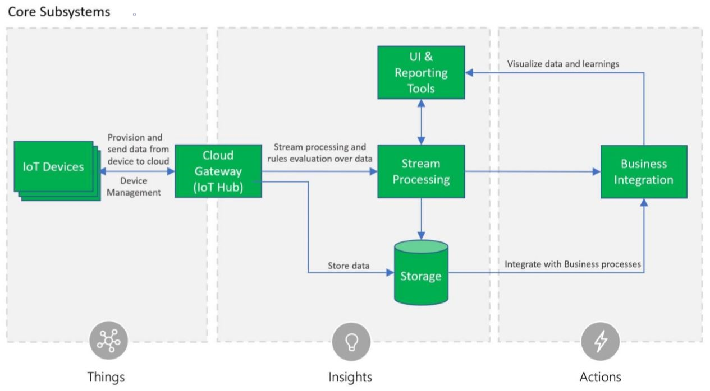

# IoT Solution

## Solutions Structure
Combining three components 
- Things, 
- Insights, 
- Actions 

model with the subsystems 
- Devices, 
- Hub, 
- Processors, 
- Interfaces, and 
- Storage.

> See [Subsystems of an IoT architecture](https://learn.microsoft.com/en-us/training/modules/introduction-iot-solution-architecture/2-subsystems-iot-architecture)
>
> **IoT Devices:** The physical devices where our data originates.
> 
> **Cloud Gateway:** The Cloud Gateway provides a cloud hub for secure connectivity, telemetry, and event ingestion and device management (including command and control) capabilities.
> 
> **User Interface and Reporting:** The user interface for an IoT application can be delivered on a wide array of device types, in native applications, and browsers.
> 
> **Stream Processing:** Processes large streams of data records and evaluates rules for those streams.
> 
> **Storage:** Storage can be divided into warm path (data that is required to be available for reporting and visualization immediately from devices), and cold path (data that is stored longer term and used for batch processing).
> 
> **Business Process Integration:** Facilitates executing actions based on insights garnered from device telemetry data during stream processing. Integration could include storage of informational messages, alarms, sending email or SMS, integration with CRM, and more.

Cross-cutting Architectural needs
- Security
- Logging
- Disaster Recovery and 

> [Cross-cutting architectural needs](https://learn.microsoft.com/en-us/training/modules/introduction-iot-solution-architecture/4-cross-cutting-architectural-concerns)
> 
> Security: Security is a critical consideration in each of the subsystems. Protecting IoT solutions requires secure provisioning of devices, secure connectivity between devices, edge devices, and the cloud, secure access to the backend solutions, and secure data protection in the cloud during processing and storage (encryption at rest).
> 
> Logging and monitoring: Logging actions and monitoring activity associated with your IoT solution is critical for determining system uptime and troubleshooting failures.
> 
> High availability and disaster recovery: High availability and disaster recovery (HA/DR) focuses on ensuring an IoT system is always available, including from failures resulting from disasters. The technology used in IoT subsystems has different failover and cross-region support characteristics. For IoT applications, this can result in requiring hosting of duplicate services and duplicating application data across regions depending on acceptable failover downtime and data loss.