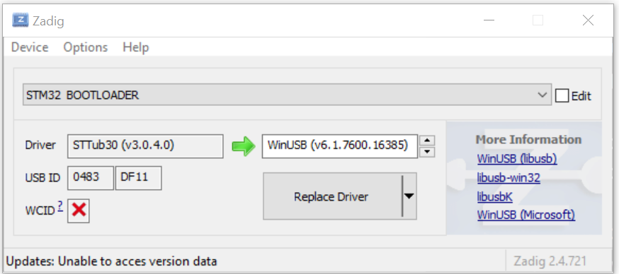

# Wilderness Labs

## Computer Set up & Board Set Up
Use directions from *Wilderness Labs*: 
- [Meadow OS Deployment](http://developer.wildernesslabs.co/Meadow/Getting_Started/Deploying_Meadow/)

### Install on windows
- Install .NET 5.0 SDK
- Use Zadig to change driver for the wl device in bootloader mode.
    - [Zadig](https://zadig.akeo.ie/)
    - **STM32 BOOTLOADER** to **WinUSB (v.6.1.7600.16385)**

 - Install (or update) meadows CLI globally
    - `dotnet tool install WildernessLabs.Meadow.CLI --global`
    - `dotnet tool update WildernessLabs.Meadow.CLI --global`
- Install dfu-util
  >dfu-util is a command line tool for Device Firmware Upgrade via USB port. When Duo is in DFU mode, we can use dfu-util to download firmware to Duo, as well as upload firmware from Duo to local binary file.
  >
  >dfu-util uses libusb 1.0 to access your device, so on Windows you have to register the device with the WinUSB driver (alternatively libusb-win32 or libusbK), please see the libusb wiki for more details.
    - `meadow install dfu-util`
 - Download OS
    - `meadow download os`
